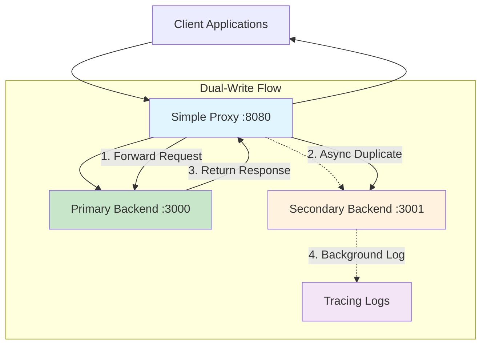
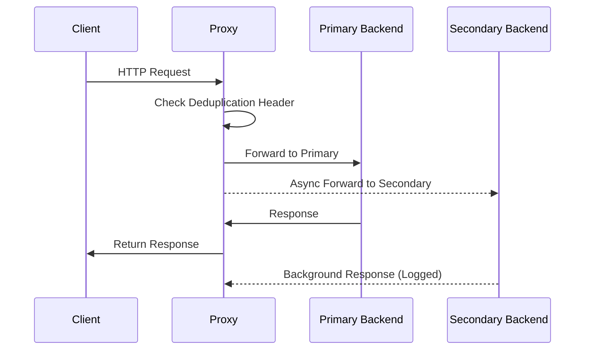

# Simple Proxy

[](https://www.rust-lang.org)
[](https://opensource.org/licenses/MIT)
[]()

> A high-performance dual-write reverse proxy built with Pingora for data migration validation, primary-backup consistency checks, and disaster recovery scenarios.

## 🚀 Quick Navigation

- [Overview](#overview)
- [Architecture](#architecture)
- [Quick Start](#quick-start)
- [API Documentation](#api-documentation)
- [Configuration](#configuration)
- [Use Cases](#use-cases)
- [Development](#development)
- [Contributing](#contributing)

## Overview

`simple_proxy` is a production-ready dual-write reverse proxy server built on [Pingora](https://github.com/cloudflare/pingora), Cloudflare's high-performance proxy framework. It simultaneously forwards HTTP requests to two backend services, enabling seamless data migration validation, primary-backup consistency verification, and disaster recovery testing.

### Key Features

- **🔥 High Performance**: Built with Pingora for exceptional throughput and low latency
- **🔄 Dual-Write Pattern**: Simultaneous request forwarding to primary and secondary backends
- **🛡️ Production Ready**: Comprehensive error handling and request deduplication
- **🔐 Secure**: Argon2 password hashing and secure user management
- **📊 Observable**: Built-in tracing and health check endpoints
- **⚡ Async First**: Fully asynchronous architecture with Tokio runtime

### Technology Stack

| Component | Technology | Purpose |
|-----------|------------|---------|
| **Proxy Framework** | [Pingora](https://github.com/cloudflare/pingora) | High-performance async proxy |
| **Backend Framework** | [Axum](https://github.com/tokio-rs/axum) | Modern Rust web framework |
| **Runtime** | [Tokio](https://tokio.rs/) | Async runtime |
| **HTTP Client** | [reqwest](https://github.com/seanmonstar/reqwest) | HTTP client for dual-write |
| **Password Hashing** | [Argon2](https://github.com/RustCrypto/password-hashes) | Secure password hashing |
| **Logging** | [tracing](https://github.com/tokio-rs/tracing) | Structured logging and tracing |

## Architecture

### System Overview



### Request Lifecycle



### Component Architecture

- **DualWriteProxy**: Core proxy logic implementing the dual-write pattern
- **Backend Services**: Identical Axum-based REST APIs with user management
- **Request Deduplication**: Prevents infinite loops with custom headers
- **Async Background Tasks**: Non-blocking secondary requests

## Quick Start

### Prerequisites

- Rust 1.70+ (2021 edition or later)
- Cargo package manager

### Installation & Setup

1. **Clone the repository**
   ```bash
   git clone <repository-url>
   cd simple_proxy
   ```

2. **Start the backend services**

   Terminal 1 (Primary Backend):
   ```bash
   cargo run --example server
   # Listening on 127.0.0.1:3000
   ```

   Terminal 2 (Secondary Backend):
   ```bash
   cargo run --example server_1
   # Listening on 127.0.0.1:3001
   ```

3. **Start the proxy service**

   Terminal 3 (Proxy):
   ```bash
   cargo run
   # DualWriteProxy listening on 0.0.0.0:8080
   ```

4. **Verify the setup**
   ```bash
   # Test dual-write functionality
   curl -X POST http://127.0.0.1:8080/users \
     -H 'Content-Type: application/json' \
     -d '{"name":"Alice","email":"alice@example.com","password":"secure123"}'

   # Verify data on both backends
   curl http://127.0.0.1:3000/users  # Primary
   curl http://127.0.0.1:3001/users  # Secondary
   ```

## API Documentation

### User Management Endpoints

All endpoints are available through the proxy (`http://localhost:8080`) and will be forwarded to both backend services.

#### User Model
```json
{
  "id": 1,
  "name": "Alice",
  "email": "alice@example.com",
  "created_at": "2024-01-01T12:00:00Z",
  "updated_at": "2024-01-01T12:00:00Z"
}
```

#### Available Endpoints

| Method | Endpoint | Description | Example |
|--------|----------|-------------|---------|
| `GET` | `/users` | List all users | `curl http://localhost:8080/users` |
| `GET` | `/users/{id}` | Get user by ID | `curl http://localhost:8080/users/1` |
| `POST` | `/users` | Create new user | See examples below |
| `PUT` | `/users/{id}` | Update user | See examples below |
| `DELETE` | `/users/{id}` | Delete user | `curl -X DELETE http://localhost:8080/users/1` |
| `GET` | `/health` | Health check | `curl http://localhost:8080/health` |

#### Request Examples

**Create User**
```bash
curl -X POST http://localhost:8080/users \
  -H 'Content-Type: application/json' \
  -d '{
    "name": "John Doe",
    "email": "john@example.com",
    "password": "secure_password_123"
  }'
```

**Update User**
```bash
curl -X PUT http://localhost:8080/users/1 \
  -H 'Content-Type: application/json' \
  -d '{
    "name": "John Updated",
    "email": "john.updated@example.com"
  }'
```

**List Users**
```bash
curl http://localhost:8080/users
```

### Proxy-Specific Headers

The proxy adds custom headers for tracking and debugging:

- `user-content: dual-write` - Added to upstream requests
- `user-content: response by kevin` - Added to responses
- `x-dual-write-executed: true` - Prevents request loops

## Configuration

### Default Ports

| Service | Port | Purpose |
|---------|------|---------|
| Proxy | 8080 | Main entry point |
| Primary Backend | 3000 | Primary data store |
| Secondary Backend | 3001 | Secondary/backup store |

### Environment Variables

```bash
# Logging level (optional)
RUST_LOG=debug

# Custom port configuration (modify source code)
# Default values are hardcoded in main.rs and examples/
```

### Production Considerations

- **Load Balancing**: Deploy multiple proxy instances behind a load balancer
- **Health Monitoring**: Use `/health` endpoints for health checks
- **Logging**: Configure structured logging with appropriate levels
- **Security**: Ensure proper network isolation between services

## Use Cases

### 1. Database Migration Validation

Perfect for validating data consistency during database migrations:

```bash
# Old system writes to primary (existing database)
# New system writes to secondary (new database)
# Compare results to ensure migration accuracy
```

### 2. A/B Testing Infrastructure

Test new backend implementations against existing ones:

```bash
# Primary: Current production system
# Secondary: New implementation under test
# Monitor differences in responses and performance
```

### 3. Disaster Recovery Testing

Validate backup systems without affecting production:

```bash
# Primary: Production system
# Secondary: Disaster recovery system
# Ensure DR system stays in sync
```

### 4. Data Consistency Auditing

Continuous validation of data synchronization:

```bash
# Compare responses from both backends
# Alert on discrepancies
# Maintain audit trails
```

## Development

### Project Structure

```
simple_proxy/
├── src/
│   ├── main.rs          # Proxy service entry point
│   └── lib.rs           # DualWriteProxy implementation
├── examples/
│   ├── server.rs        # Primary backend (port 3000)
│   ├── server_1.rs      # Secondary backend (port 3001)
│   └── test.rest        # HTTP test cases
├── Cargo.toml           # Dependencies and metadata
└── README.md            # This file
```

### Running Tests

```bash
# Run all tests
cargo test

# Run with output
cargo test -- --nocapture

# Run specific test
cargo test test_create_user
```

### Development Setup

1. **Install Rust toolchain**
   ```bash
   curl --proto '=https' --tlsv1.2 -sSf https://sh.rustup.rs | sh
   ```

2. **Install development tools**
   ```bash
   cargo install cargo-watch  # Auto-reload during development
   cargo install cargo-edit   # Easy dependency management
   ```

3. **Development workflow**
   ```bash
   # Auto-reload proxy during development
   cargo watch -x run

   # Auto-reload backend services
   cargo watch -x 'run --example server'
   cargo watch -x 'run --example server_1'
   ```

### Code Quality

- **Formatting**: `cargo fmt`
- **Linting**: `cargo clippy`
- **Security Audit**: `cargo audit` (requires cargo-audit)
- **Documentation**: `cargo doc --open`

## Contributing

We welcome contributions! Please follow these guidelines:

### Development Process

1. **Fork the repository**
2. **Create a feature branch**: `git checkout -b feature/amazing-feature`
3. **Make your changes** with appropriate tests
4. **Run the test suite**: `cargo test`
5. **Format your code**: `cargo fmt`
6. **Submit a pull request**

### Code Standards

- Follow Rust naming conventions
- Add tests for new functionality
- Update documentation for API changes
- Use `tracing` for logging, not `println!`
- Handle errors appropriately with `Result<T, E>`

### Reporting Issues

Please use GitHub Issues for:
- Bug reports
- Feature requests
- Performance issues
- Documentation improvements

## License

This project is licensed under the MIT License - see the [LICENSE.md](LICENSE.md) file for details.

## Acknowledgments

- [Pingora](https://github.com/cloudflare/pingora) - High-performance proxy framework by Cloudflare
- [Axum](https://github.com/tokio-rs/axum) - Ergonomic web framework for Rust
- [Tokio](https://tokio.rs/) - Asynchronous runtime for Rust

---

**Built with ❤️ in Rust**
